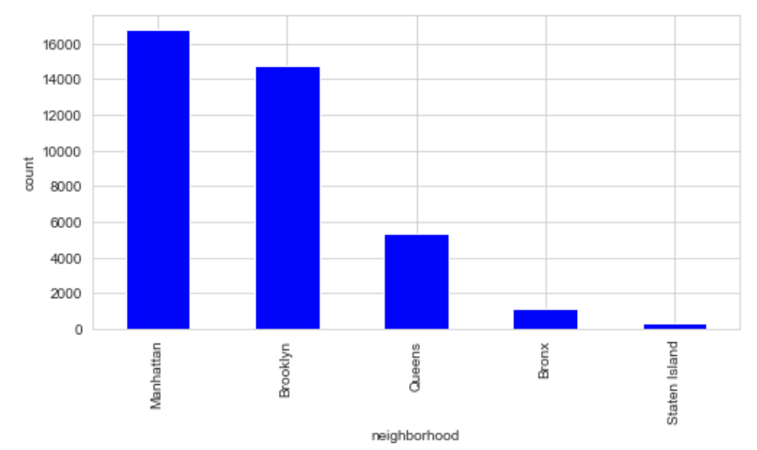

# NYC Airbnb: Price Prediction with Machine Learning

## Soo Ho (John) Park

# Introduction

New York City is a financial powerhouse, multicultural hub, and tourist hotspot, being one of the most coveted real estate areas in the world. The stakeholders are current and prospective Airbnb hosts who are seeking real estate investments opportunities in New York City. With countless features and variations involved in Airbnb listings, it is exceedingly difficult to understand which features are important in influencing price. Thus, I aim to answer the following question: what home features and characteristics predict a higher range of prices?

By utilizing multiple machine learning models as a predictive measure, I offer a set of recommendations tailored to the airbnb hosts' needs. I analyze which indicators can predict the price per night of a listing and find which type of homes hosts ought to invest in. Through thorough data analysis, I discovered that our stakeholders ought to prioritize privacy, credibility, and flexibility to ensure a higher range in price. I recommend that Airbnb hosts seek out Entire Homes, Apartments, or Private rooms as opposed to shared rooms, since privacy plays a huge role in influencing price. Furthermore, number of reviews and high review scores influence price, meaning that users are seeking for credible and low risk places that have already been verified by others. Hosts ought to ensure that their listings have multiple high ratings reviews. Lastly, flexible policies that allow users to have more availability and shorter minimum nights can influence price as well.

# Data Understanding

The original data set `listings.csv` was extracted from a website called Inside Airbnb, which is an independent, non-commercial, open source data tool that synthesizes Airbnb data. This dataset contained 38277 entries with 74 columns, consisting of listings in the New York City area. The relevant features included price per night, longitude, latitude, room type, neighborhood, number of reviews, review score rating, and etc. From a business understanding standpoint, such features of the listings, specifically those based on type of room, location, and users' reception, seemed to have a influence on price. Thus, analyzing the relationship between such features and price, I sought out to create a model that accurately predicts price per night. One feature that could have been more helpful in gaining perspective on price selections would be occupancy rate, which was not made public. How many days the listings were occupied could have influenced price as well, considering supply and demand affects pricing.

# Data Preparation

This project used a variety of Python libraries to carry-out this project. 
Pandas  v1.1.3
Numpy   v1.18.5
SciKit-Learn  v0.23.2
Matplotlib v3.3.1
Folium

### Data Cleaning:

Starting data preparation, I first removed the irrelevant features, since 74 features were far too extensive. I then converted the price per night from string to float, separated the listings into two price ranges as categorical variables, and removed outliers that are 3 standard deviations away.

### Feature Engineering:

By using one hot encoding, I binned neighborhood_group_cleansed and type of room into dummies to observe if location and room type had an influence on price. For room type, the dummies consisted of Entire home/apt, Hotel room, Private room, and Shared Room. For neighborhoods, the dummies consisted of Manhattan, Queens, Brooklyn, Bronx, and Staten Island.

### Price

### Map

For data visualization, I extracted the `latitude`,`longitude`,and `price` into a separate dataframe, and then used folium to map out listings. This map of New York City displays all listings with yellow circles representing higher priced listings (above or equal to $110 per night) and green circles representing lower priced listings (lower than $110 per night).

### Words Associated with High Prices

By using the wordcloud technique on `description`, I explored which specific words often used to describe listings with high prices.

### Neighborhood

Since location, specifically neighborhoods, may have a strong influence over the price per night of listings, I first visualized the distribution of listings by neighborhood

# Final Model: Logistic Regression
I experiment with a total of four models: logistic regression, decision tree, random forest, and k-NN models. Out of all models, the logistic regression model yielded the most accurate results.

As the main evaluation metrics, I use accuracy and ROC-AUC. Accuracy is an evaluation metric that allows you to measure the total number of predictions a model gets correct, meaning it looks at True Positives and True Negatives. This can give us a general understanding of our model.

ROC AUC can reveal how much the model is capable of distinguishing between classes via the False Positive Rate and the True Positive Rate. One whose predictions are 100% correct has an AUC of 1.0.

### Confusion Matrix

True Positives: 7668
True Negatives: 7117
False Positives: 1716
False Negatives 1451

## Evaluation Metrics

Mean accuracy of the final model: 0.8236970947951743

AUC of the ROC Curve of the final model: 0.90

# Best Feature

What are the most important features for predicting the price range of a listing? I utilized the ExtraTreesClassifier method. This class implements a meta estimator that fits a number of randomized decision trees (a.k.a. extra-trees) on various sub-samples of the dataset and uses averaging to improve the predictive accuracy and control over-fitting.

# Conclusion

I recommend that Airbnb hosts seek out Entire Homes, Apartments, or Private rooms as opposed to shared rooms, since privacy plays a huge role in influencing price. Furthermore, number of reviews and high review scores influence price, meaning that users are seeking for credible and low risk places that have already been verified by others. Hosts ought to ensure that their listings have multiple high ratings reviews. Lastly, flexible policies that allow users to have more availability and shorter minimum nights can influence price as well.

For future steps, I aim to discover if geolocation to cafes, restaurants, and green space has a heavy influence on price. Moreover, what words are used to describe the listing may have an impact on price as well, since rhetoric and flowery language can catch users’ attention. I would also like to understand which specific advertising tactics can lead to higher prices.
